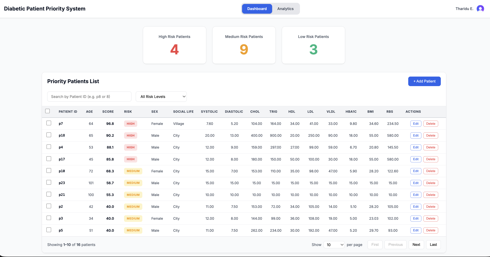
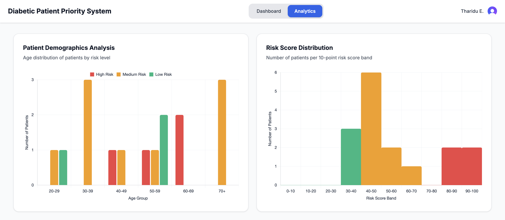

# Diabetic Patient Priority System

**For clinicians:** A smart dashboard that automatically ranks your diabetic patients by clinical urgency — so your team always knows who needs attention first.

**For developers:** A full-stack system built with React, Node.js, MySQL, and a Python Random Forest classifier that scores patients across 13 clinical indicators on a 0–100 risk scale.

## Preview


---

## Tech Stack

**Frontend**
- React — component-based UI
- Vite — build tool and development server
- Clerk — authentication and session management

**Backend**
- Node.js + Express.js — RESTful API
- MySQL — patient data storage
- Zod — server-side input validation

**Machine Learning**
- Python + FastAPI — ML service
- scikit-learn — Random Forest classifier
- pandas / numpy — data processing

---

## Features

### Dashboard
- Summary cards showing High, Medium, and Low risk patient counts
- Priority patient list sorted by risk score (highest first)
- Search by Patient ID (e.g. `p8` or `8`)
- Filter patients by risk level

### Patient Management
- Add, edit, and delete patient records
- Client and server-side validation with clinical range checking
- Risk score and category automatically recalculated on every save

### Machine Learning
- Random Forest model trained on historical patient data
- Risk scored on a 0–100 continuous scale
- Three risk categories: Low (0–39), Medium (40–69), High (70–100)
- 7 features used for prediction: HbA1c, Age, Sex, BP Systolic, BP Diastolic, BMI, RBS
- 13 clinical indicators collected via the form: Age, Sex, Social Life, BP Systolic, BP Diastolic, Cholesterol, Triglycerides, HDL, LDL, VLDL, HbA1c, BMI, RBS

### Analytics
- Age distribution chart split by risk category
- Risk score histogram across 10-point bands

---

## Prerequisites

- Git
- Node.js (v14 or higher)
- npm
- MySQL (v8.0 or higher)
- Python (v3.8 or higher)

---

## Setup

### 1. Clone the Repository

```bash
git clone https://github.com/deshanekanayaka/diabetic-risk-classification-system
cd diabetic-risk-classification-system
```

### 2. Frontend Setup

```bash
cd frontend
npm install
```

Create a `.env` file in the `frontend/` directory:

```env
VITE_API_URL=http://localhost:3000
VITE_CLERK_PUBLISHABLE_KEY=your_clerk_publishable_key_here
```

### 3. Backend Setup

```bash
cd backend
npm install
```

Create a `.env` file in the `backend/` directory:

```env
# Server
PORT=3000
NODE_ENV=development

# Database
DB_HOST=localhost
DB_USER=root
DB_PASSWORD=your_mysql_password
DB_NAME=diabetic_db
DB_PORT=3306

# ML Service
ML_SERVICE_URL=http://localhost:8001
```

### 4. Database Setup

```bash
mysql -u root -p
```

```sql
CREATE DATABASE diabetic_db;
USE diabetic_db;
```

```bash
mysql -u root -p diabetic_db < backend/database/schema.sql
```

Optionally load sample data:

```bash
mysql -u root -p diabetic_db < backend/database/seed.sql
```

### 5. Machine Learning Setup

```bash
cd machine-learning
python -m venv venv
source venv/bin/activate        # Windows: venv\Scripts\activate
pip install -r requirements.txt
python train_model.py           # trains and saves the model
```

---

## Running the Project

Open three terminal windows:

**Terminal 1 — Backend**
```bash
cd backend
node server.js
```
Runs at `http://localhost:3000`

**Terminal 2 — ML Service**
```bash
cd machine-learning
source venv/bin/activate        # Windows: venv\Scripts\activate
uvicorn app:app --reload --port 8001
```
Runs at `http://localhost:8001`

**Terminal 3 — Frontend**
```bash
cd frontend
npm run dev
```
Runs at `http://localhost:5173`

---

## API Endpoints

Base URL: `http://localhost:3000`

### Authentication
| Method | Endpoint | Description |
|--------|----------|-------------|
| POST | `/api/auth/signup` | Create clinician account |
| POST | `/api/auth/login` | Clinician login |

### Patients
| Method | Endpoint | Description |
|--------|----------|-------------|
| GET | `/api/patients` | Get all patients (supports `clerk_id`, `riskLevel`, `sortBy` query params) |
| GET | `/api/patients/:id` | Get patient by ID |
| POST | `/api/patients` | Add new patient |
| PUT | `/api/patients/:id` | Update patient record |
| DELETE | `/api/patients/:id` | Delete patient |

### Analytics
| Method | Endpoint | Description |
|--------|----------|-------------|
| GET | `/api/analytics` | Get age distribution and risk score histogram data |

### ML Service
| Method | Endpoint | Description |
|--------|----------|-------------|
| GET | `/` | Health check |
| POST | `/predict` | Predict risk score for a patient |

---

## Production Build

```bash
cd frontend
npm run build
```

Output will be in the `dist/` directory.

---

## Future Enhancements

- Integration with hospital Electronic Medical Record (EMR) systems
- Mobile application
- Automated notifications and reminders for follow-up appointments
- Patient outcome tracking and model retraining on real clinical labels
- Export functionality for reports and analytics

---

## Note

This is a prototype system built for educational purposes. 
For deployment in clinical settings, additional regulatory compliance,
security audits, and clinical validation are required.